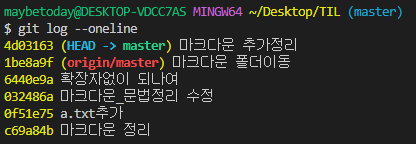

# git

 


> 분산 버전(형상) 관리 시스템

- CLI (Command Line Interface)
- 코드의 버전을 관리하는 도구
- 컴퓨터 파일의 변경사항을 추적하고 사용자들 간에 해당 파일들의 작업을 조율

## 기본흐름

1. 작업을 하고
2. 변경된 파일을 모아(add)
3. 버전으로 남긴다(commit)

git은 파일을 modified, staged, committed로 관리 (1통,2통,3통)


## 기본 명령어

> git 사용법


### git 설정 파일(config)

- 사전 설정(PC당 최초 한번)

```bash
$ git config --global user.name 'GitHub ID'
$ git config --global user.email 'GitHub Email'
```

- 설정 확인


### $ git init

> 로컬 저장소 생성


### $ git add <파일명>

> 특정 파일/폴더의 변경사항 추가


### $ git commit -m <커밋메세지>

> git commit 으로 길게 메세지 작성가능


### $ git log

> 버전 확인

- 현재 저장소에 기록된 커핏을 조회

- 다양한 옵션을 통해 로그를 조회할 수 있음
  - `$ git log -1` / `$ git log --onelice` / `$ git log -3 --oneline`




### $ git status

> 상태 확인

- git 저장소에 있는 파일의 상태를 확인하기 위하여 활용
  - 파일의 상태를 알 수 있음
    - untracked files
    - changes not staged for commit
    - changes to be committed
  - Noting to commit, working tree clean

**파일 라이프사이클**

- Status로 확인할 수 있는 파일의 상태 
  - `tracked` : 이전부터 버전으로 관리되고 있는 파일 
  - `unmodified` : git status에 나타나지 않음 
  - `Modified` : Changes not staged for commit 
  - `Staged` : Changes to be committed 
- `Untracked` : 버전으로 관리된 적 없는 파일 (파일을 새로 만든 경우)